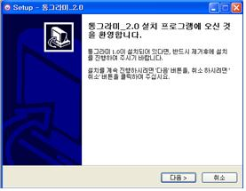

1.  [설치하기](01-install)
2.  [자료 입력(Data Input)](01-input)
3.  [자료 저장(Data Save)](01-save)
4.  [예제 자료 입력 및 저장](01-example)

### 설치하기 
#### 시스템 환경

    통그라미를 설치하려면 다음과 같은 컴퓨터 시스템환경이 필요합니다.

- 컴퓨터 성능 :	IBM PC CPU 2.0GHZ이상 권장
- 하드디스크 : 	설치용량 200MB 
- 운영체제 : 		Windows XP/NT/7 이상
- 실행환경 : 		JRE 1.7.0_45이상
- 메모리 : 		2GB 이상 권장
- 비디오 : 		표준 VGA 이상

#### 설치하기

    통그라미를 설치하려면 통계진흥원 홈페이지에서 통그라미 파일을 다운받아서 다음과 같은 순서대로 작업을 하면 됩니다.  

1. Tong.zip 파일의 압축을 풀어 setup.exe를 실행시켜 아래 화면이 나타나면 다음 버튼을 클릭합니다.  

    

2. 아래와 같은 설치할 경로를 묻는 화면이 나타납니다. C:\Program Files\ Tong폴더(64비트 컴퓨터에서는 C:\Program Files(x86)\Tong 가 기본 폴더일 수 있습니다. 단 시스템에 따라 폴더명이 다를 수 있습니다). 설치하려면 다음 버튼을 눌러 설치를 진행합니다. 만일 통그라미가 이전에 설치되었다면 모든 Tong 폴더를 삭제하고 다시 설치하는 것이 좋습니다.  

    

3. 시작 메뉴 폴더를 선택하는 창에서 프로그램의 단축메뉴가 설치되는 폴더를 선택하고 다음 버튼을 누릅니다. 

    

4. 아래와 같은 설치준비 완료 화면이 나타나면 설치를 선택합니다
    
    

5. 설치가 잠시 진행되며(기종에 따라 시간이 다를 수 있음) 그 후 통그라미 설치완료 화면이 나타납니다. 완료를 누르면 설치가 끝납니다.

    

6. 설치가 끝나면 바탕화면에 통그라미의 실행 아이콘이 자동으로 생성되며 프로그램을 실행시키려면 이 아이콘을 더블클릭 합니다. 실제 실행파일명은 Tong.exe 입니다. 다음 그림과 같은 통그라미 로고화면이 나타나고 이어서 주화면이 나타납니다.

    
    

주화면은 다음과 같이 크게 여섯 부분으로 나뉘어져 있습니다.

> ①  화면 윗부분에는 9가지의 풀다운 메뉴형식 주메뉴 
>    파일(F), 편집(E), 보기(V), 변환(T), 그래프(G), 통계(S), 창열기(O), 
>    창전환(C), 도움말(H) 
> ②  주메뉴 아래에는 네 가지의 단축키 모음
>    일반 도구모음, 그래프 도구모음, 통계 도구모음, 창 도구모음
> ③  좌측에는 자료를 입력하는 자료창
> ④  우측 위에는 변수에 대한 정보를 입력하는 변수창
> ⑤  우측 아래에는 그림이 그려지는 그래프창
> ⑥  화면 제일 아래에는 상태표시줄(‘준비완료’ 등을 표시)

메뉴나 도구모음에서 원하는 명령을 마우스로 누르면 선택이 됩니다. 단 창 도구모음의 단축키(자료창, 변수창, 문서창, 그래프창)는 마우스를 이용하여 화면 적당한 부분으로 끌어옵니다(이를 드래그(drag)라고 함). 
  
통그라미 주화면의 왼쪽에 보이는 창이 자료를 입력하는 자료창인데 이 자료창에서 사용되는 용어를 정리하면 다음 표와 같습니다.

<table>
	<tr><th>용어</th><th>해설</th></tr>
	<tr><td>셀(cell)<td></td>자료를 입력받을 수 있는 사각형 모양의 칸</td></tr>
	<tr><td>시트(sheet)<td></td>셀을 가로와 세로로 줄을 맞추어 놓은 창 </td></tr>
	<tr><td>행 또는 가로줄<td></td>자료창 시트에서 가로로 한 줄의 모든 셀을 의미함
자료번호 1, 자료번호 2, ... 로 표시</td></tr>
	<tr><td>열 또는 세로줄<td></td>자료창 시트에서 세로로 한 줄의 모든 셀을 의미함
V1, V2, ... 로 표시</td></tr>
	<tr><td>변수(variable)<td></td>설문 문항을 변수라 부름</td></tr>
	<tr><td>분석변수<td></td>설문 문항을 간단히 표현할 수 있는 한글 8자까지의 명칭

예) 문항 ‘귀하의 성별은?’을 간단히 ‘성별’로 표시함</td></tr>
	<tr><td>변숫값<td></td>성별 문항의 응답을  ‘① 남자 ② 여자’ 로 질문하고 자료정리를 간단히 1 또는 2로 표시하는 경우의 숫자를 변숫값이라 함
체중 문항의 변숫값은 실제 체중값 60kg 등</td></tr>
	<tr><td>변수의 형태
			<ol>
			  <li>문자형 변수</li>
			  <li>범주형 변수</li>
			  <li>연속형 변수</li>
			</ol>
		</td>
		<td>변수는 문자형과 범주형과 연속형으로 구분.
			<ol>
			  <li>문자형: 한글이나 영문자 변숫값을 갖는 변수</li>
			  <li>범주형: 변숫값이 숫자로서 9개 이하의 서로 다른 값을 갖는 경우(예: 성별, 수학선호도)</li>
			  <li>연속형: 변숫값이 숫자로서 10개 이상의 서로 다른 값을 갖는 경우(예: 신장, 체중)</li>
			</ol>
		</td>
	</tr>
</table>

